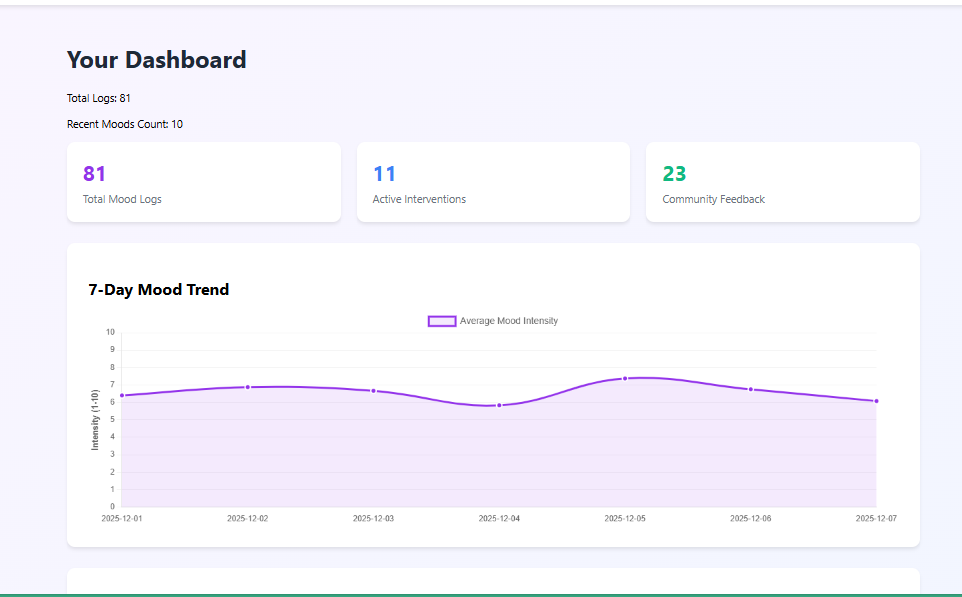
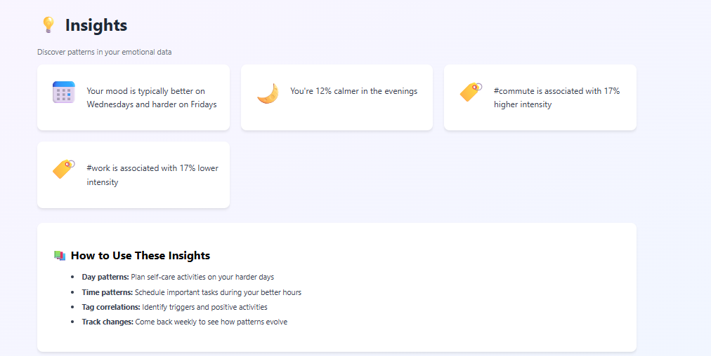
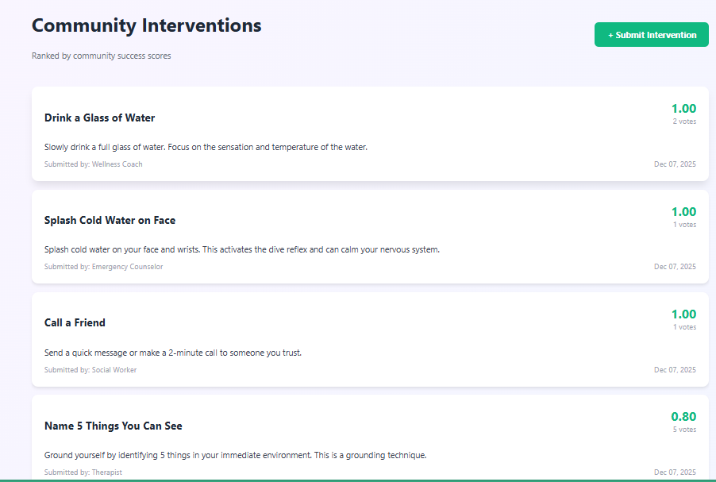

# 💜 Emotion Map

**Community-Powered Emotional Self-Awareness Tool**

A Django web application that helps users gain emotional self-awareness through fast mood logging, data-driven micro-interventions, and intelligent pattern recognition. Built to support **UN SDG 3: Good Health and Well-being**.


---


## 📸 Images

### Dashboard

*Real-time mood trends and statistics*

### Mood Logging

*Quick and intuitive mood entry form*

### Emotional Heatmap

*Visualize mood patterns by time and day*

### Pattern Insights

*Discover correlations between activities and emotions*

### Intervention Library

*Community-rated micro-interventions*

---

## 🌟 Key Features

### 1. **User Authentication**
- Secure registration and login system
- Personal mood tracking for each user
- Privacy-focused data storage

### 2. **Fast Mood Logging**
- Log emotional states with intensity ratings (1-10)
- Add contextual tags (#Work, #Home, #Exercise)
- Optional notes for deeper reflection

### 3. **Community-Powered Intervention Library**
- Micro-interventions (e.g., "Take 3 deep breaths")
- Community success scoring based on user feedback
- Vote on effectiveness: Helped / No Change / Made it Worse

### 4. **Data-Driven Insights**
- **Emotional Heatmap**: Visualize mood intensity by time of day and day of week
- **Correlation Engine**: Discover patterns like "Anxiety peaks on Mondays with #WorkDeadline"
- **Trend Charts**: 7-day mood intensity tracking with Chart.js

### 5. **Interactive UI**
- Clean, modern design with custom CSS
- Chart.js for interactive data visualizations

---

## 🎯 SDG 3 Alignment

This project directly supports **UN SDG 3: Good Health and Well-being** by:

- ✅ Promoting mental health awareness through self-tracking
- ✅ Providing accessible, evidence-based interventions
- ✅ Empowering users with data-driven insights into emotional patterns
- ✅ Creating a community-driven approach to mental wellness

---

## 🛠️ Technology Stack

| Component | Technology |
|-----------|------------|
| Backend | Django |
| Database | SQLite (development) |
| Frontend | HTML, CSS, JavaScript |
| Interactivity | HTMX  |
| Visualizations | Chart.js  |
| Language | Python  |
| Authentication | Django Auth System |


---

## 📈 Key Algorithms

### Community Success Score

The intervention efficacy scoring uses this formula:

```python
score = (helped_votes - worse_votes) / total_votes
```

**Range**: -1.0 (worst) to +1.0 (best)

**Example**:
- 10 "Helped" votes
- 2 "No Change" votes
- 1 "Made it Worse" vote
- **Score = (10 - 1) / 13 = 0.69**

### Heatmap Aggregation

Uses Django ORM to aggregate mood intensity by:
- Day of week (0=Monday, 6=Sunday)
- Hour of day (0-23)

```python
avg_intensity = Mood.objects.filter(
    user=request.user,
    timestamp__week_day=day_idx,
    timestamp__hour=hour
).aggregate(Avg('intensity'))
```

---

## 🎨 Usage Examples

### 1. User Registration & Login
```
1. Create account with username and password
2. Log in to access personal dashboard
3. All mood data is private to each user
```

### 2. Log a Mood
```
Emotion: Anxiety
Intensity: 7/10
Tags: work, deadline
Note: "Big presentation tomorrow"
```

### 3. Get Intervention
```
System suggests: "Take 3 Deep Breaths"
User tries intervention
Provides feedback: "Helped"
→ Updates community success score
```

### 4. View Insights
```
- Heatmap shows: Anxiety peaks Monday mornings (9-11 AM)
- Correlation: #work tag → average intensity 8.2
- Top intervention: "Drink Water" (community score: 0.85)
```

---

## 🔒 Privacy & Security

- **User authentication** required for mood logging
- **Personal data isolation** - users only see their own moods
- **Secure password storage** using Django's built-in hashing
- **No email required** - anonymous registration supported
- **Community data only** - intervention ratings are aggregated

---


## 📄 License

MIT License

---

## 👤 Author

**Rehema Kemunto**  
  
[GitHub](https://github.com/Rem598) | [LinkedIn](https://linkedin.com/in/rehema-kemunto)

---

**Built with 💜 to support mental health awareness and SDG 3: Good Health and Well-being**
